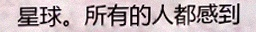
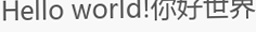
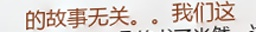

# 项目简介
基于原[text_render](https://github.com/Sanster/text_renderer) 根据自己的需求做了一些修改；
主要增加了对于色彩的支持(包含文字色彩与背景色彩图)；
Support both latin and non-latin text.

- Ubuntu 16.04
- python 3.5+

Install dependencies:
```
pip3 install -r requirements.txt

Python3 main.py
```

# Demo



# 文字变换特效
编辑 `configs/default.yaml` 来实现文字弯曲，模糊等效果，详见原[text_render](https://github.com/Sanster/text_renderer);
新增表格线颜色控制，字体颜色控制，添加冗余文字

|Effect name|Image|
|------------|----|
|Origin(Font size 25)||
|Perspective Transform||
|Random Crop||
|Curve||
|Light border||
|Dark border||
|Random char space big||
|Random char space small||
|Middle line||
|Table line||
|Under line||
|Emboss||
|Reverse color||
|Blur||
|font_color||
|line_color||
|extra_words||

颜色配置说明:
程序会随机拾取下方所配置颜色种类(按照fraction中的概率，所有颜色fraction相加需要等于1)，选中颜色种类后，rgb由l_boundary与h_boundary中取一个随机数确定； font_color 同理
```
line_color:
  black:
    fraction: 0.3
    l_boundary: 0,0,0
    h_boundary: 64,64,64
  gray:
    fraction: 0.7
    l_boundary: 77,77,77
    h_boundary: 230,230,230
```
冗余文字说明:
如开启选项，程序会按照设定的总概率随机选取一段独立的文字(颜色，字体及字号大小均采用正文的设置)，生成的文字长度在1到最长文本长度之间随机。 top 与 bottom 中的 fraction 决定了冗余文字生成在上方或下方的概率；
*注:由于冗余文字尽量生成在上方与下方，所以可能生成在图片之外，所以最终出现的概率会小于设定值；
```
extra_words:
  enable: true
  fraction: 0.05
  top:
    fraction: 0.5
  bottom:
    fraction: 0.5
```


# Strict mode
For no-latin language(e.g Chinese), it's very common that some fonts only support
limited chars. In this case, you will get bad results like these:


Select fonts that support all chars in `--chars_file` is annoying.
Run `main.py` with `--strict` option, renderer will retry get text from
corpus during generate processing until all chars are supported by a font.

# Tools
You can use `check_font.py` script to check how many chars your font not support in `--chars_file`:
```bash
python3 tools/check_font.py

checking font ./data/fonts/eng/Hack-Regular.ttf
chars not supported(4971):
['第', '朱', '广', '沪', '联', '自', '治', '县', '驼', '身', '进', '行', '纳', '税', '防', '火', '墙', '掏', '心', '内', '容', '万', '警','钟', '上', '了', '解'...]
0 fonts support all chars(5071) in ./data/chars/chn.txt:
[]
```

# Generate image using GPU
If you want to use GPU to make generate image faster, first compile opencv with CUDA.
[Compiling OpenCV with CUDA support](https://www.pyimagesearch.com/2016/07/11/compiling-opencv-with-cuda-support/)

Then build Cython part, and add `--gpu` option when run `main.py`
```
cd libs/gpu
python3 setup.py build_ext --inplace
```

# Debug mode
Run `python3 main.py --debug` will save images with extract information.
You can see how perspectiveTransform works and all bounding/rotated boxes.


# Todo
- 增加同一张图中不同字体、大小与颜色的设置；
- 增加文字侵蚀，打印不完整的效果；
